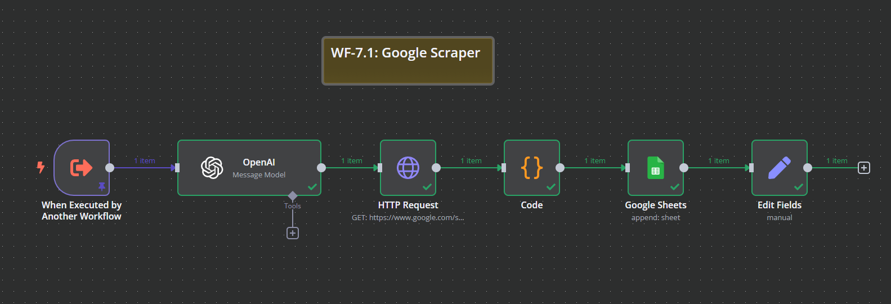
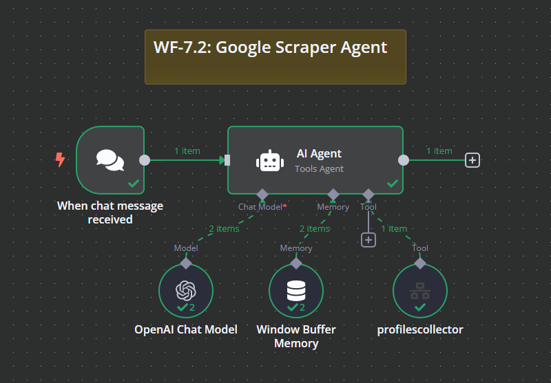

# WF-7: Google Scraper & Agent – n8n Workflow

## 📌 Overview
This **n8n workflow**, consisting of `WF-7.1: Google Scraper` and `WF-7.2: Google Scraper Agent`, automates the extraction of LinkedIn profiles from Google Search results based on job-related queries. The agent processes user queries, triggers the scraper, and stores extracted LinkedIn profiles in a Google Sheet for further use.

## 🔧 Workflow Components
### 🏠 WF-7.1: Google Scraper
1. **⚙️ Trigger – When Executed by Another Workflow** – Initiates the scraper when called by WF-7.2.
2. **🤖 OpenAI Processor** – Parses the `query` parameter and extracts `jobTitle`, `companyIndustry`, and `location`.
3. **🔎 HTTP Request (Google Search)** – Searches LinkedIn profiles on Google based on extracted parameters.
4. **📝 Code Processor** – Extracts LinkedIn profile URLs from the Google Search HTML response.
5. **📂 Google Sheets** – Saves the extracted LinkedIn profiles in a Google Sheet.
6. **✅ Set Response** – Confirms successful completion of the process.

### 🏠 WF-7.2: Google Scraper Agent
1. **💬 Chat Trigger** – Starts when a chat message is received.
2. **🤖 AI Agent** – Handles queries and determines when to trigger the scraper.
3. **🤖 OpenAI Chat Model** – Processes chat messages with contextual understanding.
4. **📋 Memory Buffer** – Stores conversation history to maintain context.
5. **🔧 Workflow Caller (profilescollector)** – Calls `WF-7.1` to scrape LinkedIn profiles.

## ⚙️ How It Works
1. 💬 **Chat Trigger** in WF-7.2 receives a user query.
2. 🤖 **AI Agent** processes the query and determines if LinkedIn profile scraping is needed.
3. 🔧 **Workflow Caller (profilescollector)** executes WF-7.1 with extracted parameters.
4. 🤖 **OpenAI Processor** in WF-7.1 extracts structured details from the query.
5. 🔎 **Google Search API** fetches LinkedIn profiles.
6. 📝 **Code Processor** extracts valid LinkedIn profile links.
7. 📂 **Google Sheets** stores the collected profile URLs.
8. ✅ **Set Response** confirms successful execution.

## 📷 Workflow Screenshot

## 🚀 Setup Instructions
- 📥 **Import both workflows** into `n8n`.
- 🔑 **Ensure API credentials** for OpenAI and Google Sheets are configured.
- ✅ **Activate the workflows** to start handling profile extractions.

## 📝 Notes
- ⚠️ The workflows are **inactive by default**.
- 🛠️ Customize the job query processing logic as needed.
